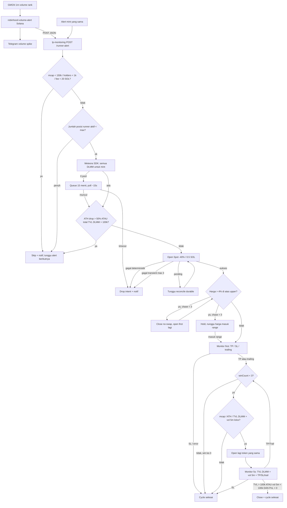

# Plan: Automatic Runner LP Agent

Status: **implemented on `Blitz`**

Upgrade `lp-monitoring` jadi agent LP otomatis untuk token runner Solana yang dikirim `robinhood-volume-alert`. Bukan sniper launch. Sinyal = mid-life heat (GMGN 1m rank + filter alert bot).

Dokumen ini adalah sumber kebenaran alur, gate, env, dan file. Jangan mulai coding sampai plan ini di-OK.

---

## 1. Keputusan yang sudah lock

| Item | Nilai |
|---|---|
| Mode eksekusi | Full auto, kill switch env terpisah dari Telegram manual trading |
| Chain | Solana only |
| Size default | `0.5` SOL, env |
| Range default | `40` (−40% dari current price), env |
| Strategy default | `spot`, env |
| Max posisi runner aktif | env, default `1` |
| Mode setelah open | TP / SL / trailing saja. Flip / Precision / Auto Rebalance **off** |
| Pool lookup | Meteora SDK + datapi. **Bukan DexScreener** |
| Vol 5m | GMGN interval 5m |
| ATH drop | `marketCapUsd / athMarketCapUsd <= 0.5` (GMGN `history_highest_market_cap`) |
| Belum ada DLMM | Queue 15 menit, lalu drop |
| Alert mint yang sama | Cek ulang dari atas, jangan double-open jika sudah ada posisi di mint itu |
| Open gagal (belum ada posisi) | Pending → reconcile. Deterministik → stop. Transient / expired / price-moved-before-send → retry sebagai first, max 3, lalu skip alert |
| Setelah open, harga >4% di atas upper | Close **tanpa swap**, open lagi sebagai **posisi pertama**. Max 3 chase. Setelah 3: hold, nunggu harga masuk range. Bukan `cycle_done`, bukan follow-up |
| Win | TP atau trailing saja. Max **3 win** per cycle, lalu `cycle_done`. Chase / SL / BIN_RANGE / TVL-vol close **bukan** win |
| Gate tiap open ulang | Setiap kali mau open lagi (retry, chase, reopen setelah TP/trail): cek ulang **mcap**, **ATH drop**, **total TVL DLMM**. Sumber live, bukan payload alert lama |

Tidak mengubah internals exit / rebalance / flip. Review finding #3 (stale balance Flip/Precision) **tidak disentuh**.

---

## 2. Konteks sistem sekarang

### 2.1 `robinhood-volume-alert`

- Monitor-only. Tidak trading.
- Solana: GMGN `market trending --chain sol --interval 1m`.
- Delivery hari ini: Telegram HTML saja. Tidak ada webhook/JSON.
- Payload internal `TokenVolume` punya mint, mcap, fee, `top10_holder_rate`. `holder_count` dan `history_highest_market_cap` ada di GMGN rank/token info tapi **dibuang**.
- `exchange` di GMGN adalah venue tag (`pump_amm`), **bukan** pool pubkey.
- Banyak alert Pump.fun / Pump AMM, bukan DLMM.

### 2.2 `lp-monitoring`

- Sudah bisa open / exit / monitor TP-SL-trailing.
- Open Telegram-first: butuh **pool pubkey**, amount, range %, strategy, confirm.
- Tidak ada mint → pool. Discovery = wallet positions.
- `executeOpenPosition` / `prepareOpenPosition` reusable.
- Open baru default Flip/Precision/Rebalance **off**.
- Satu mutasi wallet dalam satu waktu (`withWalletExecutionLock` + durable `open_pending`).
- Runtime production: `34.230.64.221`, unit `lp-monitoring.service`, cwd `/home/ubuntu/lp-monitoring`.

---

## 3. Alur end-to-end



State cycle per mint:

| State | Arti |
|---|---|
| `idle` | Tidak ada intent |
| `waiting_pool` | Mint lolos filter, belum ada DLMM, antri max 15 menit |
| `open_first` | Posisi pertama hidup. Boleh chase drift ≤3 kali. Setelah cap: hold sampai harga masuk range, lalu TP/SL/trailing |
| `reopen_eval` | Close karena TP/Trail dan `winCount < 3`. Cek ulang mcap/ATH/TVL + vol 5m sebelum open lagi |
| `open_followup` | Posisi lanjutan hidup, monitor 5 detik |
| `cycle_done` | Selesai sampai alert baru: 3 win, SL, gate gagal, atau close TVL/vol |

---

## 4. Kontrak webhook

### 4.1 Transport

- Alert bot POST setelah Solana alert lolos (Telegram tetap dikirim, independen).
- Non-Solana **tidak** dikirim.
- URL: `LP_AGENT_WEBHOOK_URL` (contoh `http://127.0.0.1:8787/runner-alert`).
- Auth: header `X-Runner-Secret` = `LP_AGENT_WEBHOOK_SECRET` / `RUNNER_ALERT_SECRET`.
- LP bot listen `RUNNER_ALERT_BIND`:`RUNNER_ALERT_PORT` (default `127.0.0.1:8787`).
- Response: `202` accepted, `401` secret salah, `400` payload invalid, `503` agent disabled.

### 4.2 Payload

```json
{
  "chainId": "sol",
  "mint": "XSTuo1fV7HHMhs4BYiwtrWSLsMCJNrooH2AssWTYZqP",
  "symbol": "XST",
  "volumeUsd": 200000,
  "marketCapUsd": 200000,
  "athMarketCapUsd": 400000,
  "holders": 2500,
  "top10HolderPct": 28.4,
  "totalFeeSol": 25.1,
  "liquidityUsd": 80000,
  "reason": "volume spike",
  "alertedAt": 1710000000
}
```

| Field | Sumber | Wajib |
|---|---|---|
| `chainId` | hardcode `sol` | ya |
| `mint` | GMGN `address` | ya |
| `symbol` | GMGN `symbol` | ya |
| `volumeUsd` | GMGN rank volume (interval alert = 1m) | ya |
| `marketCapUsd` | GMGN `market_cap` | ya |
| `athMarketCapUsd` | GMGN token info `history_highest_market_cap` | ya, skip open jika missing |
| `holders` | GMGN `holder_count` | ya |
| `top10HolderPct` | `top_10_holder_rate * 100` | tidak (informasi) |
| `totalFeeSol` | GMGN token info `total_fee` (sudah diverifikasi alert bot) | ya |
| `liquidityUsd` | GMGN `liquidity` | tidak |
| `reason` | trigger alert | tidak |
| `alertedAt` | unix seconds | ya |

Alert bot harus **menyimpan** `holder_count` dan `history_highest_market_cap` yang hari ini dibuang. `top10HolderPct` display/log; bukan gate LP (gate holder = count, bukan top-10).

---

## 5. Gate ingest (LP bot)

Urutan, short-circuit. Gagal = skip + Telegram, **tidak** antri 15 menit.

1. `RUNNER_AGENT_ENABLED=false` → `503`.
2. `chainId !== "sol"`.
3. Secret invalid.
4. `marketCapUsd < RUNNER_MIN_MCAP_USD` (150000).
5. `holders < RUNNER_MIN_HOLDERS` (1000).
6. `totalFeeSol < RUNNER_MIN_FEE_SOL` (20).
7. Jumlah posisi runner berstatus `opening|monitoring|exiting` ≥ `RUNNER_MAX_ACTIVE`.
8. Sudah ada posisi runner aktif / intent `waiting_pool|open_first|open_followup` untuk **mint yang sama** → idempotent `202`, jangan open kedua.

Mint yang sama setelah `cycle_done`: mulai cycle baru, cek ulang dari atas.

Wallet sedang `exit|reshape|open` durable: persist intent, **tunda** open sampai lock bebas. Bukan skip permanen.

`TELEGRAM_MANUAL_TRADING_ENABLED` **tidak** mem-block path ini.

---

## 6. Resolve pool Meteora

`GET https://dlmm.datapi.meteora.ag/pools` **tidak** filter by mint (122k+ pool). Jangan paginate list itu.

### 6.1 Discovery

1. SDK `@meteora-ag/dlmm`: `DLMM.getLbPairs(connection)`.
2. Filter pair di mana `tokenX` atau `tokenY` = mint runner.
3. Untuk tiap pair: `GET https://dlmm.datapi.meteora.ag/pools/{address}` (sudah dipakai `getPoolInfo`).
4. Abaikan `is_blacklisted`.
5. Simpan daftar pool di intent.

### 6.2 Agregat

- **Total TVL DLMM** = jumlah `tvl` **semua** pool DLMM mint itu (SOL, USDC, quote lain).
- **Pool untuk open** = DLMM dengan quote **WSOL**, TVL tertinggi, lolos `inspectOpenPool` (quote SOL/USDC yang sudah ada), dan `quoteCreatePosition` = 1 position + 1 setup tx.

Tidak ada DLMM sama sekali → `waiting_pool`, poll `RUNNER_POOL_POLL_MS` (15000), timeout `RUNNER_POOL_WAIT_MS` (900000).

Ada DLMM tapi tidak ada quote SOL yang valid → skip, tunggu alert berikutnya (tidak buka USDC dengan size 0.5 SOL).

### 6.3 Cache (wajib, GPA berat)

- `getLbPairs` tidak setiap 5 detik.
- Saat `waiting_pool` / follow-up: GPA max ~60 detik.
- Tick 5 detik: hanya refresh datapi untuk pool address yang sudah diketahui.
- Kalau pool baru muncul, ketahuan paling lambat pada refresh GPA berikutnya.

---

## 7. Gate open (setiap kali mau open)

Dipakai untuk **open pertama, retry, chase, dan reopen setelah TP/trail**. Ukur **sekarang** (GMGN mcap/ATH + Meteora TVL). Payload alert hanya hint.

Skip (hapus intent / `cycle_done`, tunggu alert berikutnya) jika salah satu benar:

1. `marketCapUsd < RUNNER_MIN_MCAP_USD` (150000) atau missing.
2. `athMarketCapUsd` missing atau `<= 0`.
3. `marketCapUsd / athMarketCapUsd <= RUNNER_MAX_ATH_DROP` (0.5) → drop lebih dari 50% dari ATH.
4. Total TVL semua DLMM mint itu `> RUNNER_MAX_DLMM_TVL_USD` (100000).

Chase yang sudah punya posisi: jika gate gagal → **jangan close**, hold, nunggu masuk range / SL/TP (§8.2). Bukan skip alert.

Reopen setelah TP/trail: jika gate gagal → `cycle_done`.

Retry open (belum ada posisi): jika gate gagal → skip alert.

---

## 8. Open posisi

Reuse `prepareOpenPosition` + `executeOpenPosition`. Jangan tulis path submit TX baru.

| Param | Sumber |
|---|---|
| pool | DLMM SOL terpilih |
| amount | `RUNNER_OPEN_AMOUNT_SOL` (0.5), UI string SOL |
| rangePercent | `RUNNER_RANGE_PERCENT` (40) → `calculateSingleSideRange` (−40% dari current, single-side quote) |
| strategy | `RUNNER_STRATEGY` (`spot`) |
| saldo | native ≥ amount + `OPEN_SOL_FEE_RESERVE` |

Setelah finalize:

- Status `monitoring`.
- **Jangan** `updateAutoRebalanceEnabled` / Flip / Precision.
- Tag origin `runner` + `cycleStage: first | followup` di `sync_state`.
- Global TP/SL/trailing tetap berlaku. BIN_RANGE **tidak** berlaku untuk posisi yang sedang dikelola active runner cycle (`findCycleByPosition`); BIN_RANGE tetap global untuk posisi lain.
- Langsung cek **entry drift** (§8.2) sebelum masuk monitor TP/SL.

Open in-flight: satu per wallet, sama seperti hari ini.

Target range: upper mendekati current price. Engine hari ini untuk quote SOL (Y) memakai `maxBinId = activeBinId - 1` (1 bin di bawah current). Guard kirim TX: `OPEN_MAX_PRICE_MOVE_BINS` default 3 ≈ toleransi 2–3% tergantung `binStep`. Itu **sebelum** TX. Drift §8.2 adalah **setelah** posisi finalized.

### 8.1 Open gagal (belum ada posisi on-chain)

Reuse error classes `open.ts`. Jangan spam notif.

| Kasus | Aksi |
|---|---|
| `OpenSubmissionPendingError` | Tunggu `reconcilePendingOpens`. Jangan submit open kedua. Sukses reconcile → lanjut §8.2 sebagai first. Gagal reconcile → hitung sebagai gagal open. |
| Deterministik: range >1 tx / >1 position / bins > limit / insufficient SOL / quote mismatch | Terminal. Hapus intent, 1 notif, **tidak retry**, jangan auto-kecilkan range. Tunggu alert berikutnya. |
| `DefinitiveOpenError` (TX gagal on-chain) | Posisi `opening` sudah dihapus oleh durable fail. Retry sebagai **first**, lihat baris bawah. |
| Expired / signature absent / `Pool price moved too far since preview` / RPC transient | Retry sebagai **first**. |
| Retry gagal open | Max `RUNNER_FIRST_OPEN_RETRY_MAX` (3). Masih gagal → skip, 1 notif, tunggu alert berikutnya. **Tidak** ada posisi yang bisa “nunggu masuk range”. |

Retry open mengulang gate §7 (mcap, ATH drop, total TVL DLMM) + pool SOL. Kalau gate gagal di tengah retry → skip alert, bukan paksa open.

### 8.2 Entry drift chase (posisi sudah finalized, masih `open_first`)

Kasus runner volume besar: TX sukses, harga sudah pump, posisi langsung OOR di atas upper. Fee/token mestinya belum terkumpul karena harga belum pernah masuk range.

**Syarat chase** (semua):

1. `cycleStage === first` (bukan follow-up).
2. `firstChaseCount < RUNNER_FIRST_CHASE_MAX` (3).
3. Harga pool **> 4% di atas upper range**: `(currentPriceQuote - upperBinPriceQuote) / upperBinPriceQuote > RUNNER_ENTRY_DRIFT_PCT` (0.04). Hitung dari harga bin `upperBinId` vs active, bukan dari jumlah bin.
4. Gate §7 lolos (mcap, ATH drop, total TVL DLMM) + pool SOL valid.

**Aksi:**

1. `executeExit(..., skipSwap=true)` — close tanpa swap. Trigger internal `RUNNER_ENTRY_DRIFT`. **Bukan** `reopen_eval` / follow-up.
2. Tunggu close settle.
3. `firstChaseCount += 1`.
4. Open lagi −40% dari current, Spot, size sama. Tetap `open_first`.
5. Cek drift lagi (boleh chase beruntun sampai cap).

**Setelah 3 chase:**

- **Jangan** `cycle_done`.
- **Jangan** chase/open lagi.
- Posisi terakhir **tetap hidup**.
- Tunggu harga **masuk range** (`lowerBinId <= activeBinId <= upperBinId`).
- Setelah masuk range: monitor first biasa (TP/SL/trailing). Tidak ada cek TVL/vol 5m di tahap ini.

Kalau gate §7 gagal saat mau chase: **jangan** close. Hold posisi yang ada, nunggu masuk range atau SL/TP. Satu notif “chase dibatalkan”.

Cek drift: sekali segera setelah finalize, lalu tiap tick `open_first` selama `firstChaseCount < 3` dan harga belum pernah masuk range. Setelah harga pernah in-range, chase **mati** untuk cycle ini (pump berikutnya = OOR biasa, bukan chase).

---

## 9. Monitor posisi pertama (`open_first`)

Poll `POLL_INTERVAL_MS` (default 2500). Tidak ada cek TVL/vol 5m di tahap ini. Chase §8.2 jalan di tick yang sama **sebelum** evaluasi TP/SL, hanya jika belum in-range dan chase < 3.

| Exit | Aksi |
|---|---|
| SL, error, close manual dashboard | `cycle_done`. Tidak reopen. |
| TP atau trailing | `winCount += 1`. Jika `winCount >= RUNNER_MAX_WINS` (3) → `cycle_done`. Else → `reopen_eval` |
| `RUNNER_ENTRY_DRIFT` | tetap `open_first` (bukan follow-up) |
| BIN_RANGE close | Tidak terjadi pada posisi runner aktif (disuppress di `evaluateTrigger`). Defensive fallback: `cycle_done`. |

---

## 10. Reopen setelah TP / trailing

Hanya jika close itu **win** (TP atau trailing) dan `winCount < RUNNER_MAX_WINS` (3). Win ke-3 → `cycle_done`, tidak open lagi.

Syarat **semua** harus benar, diukur **sekarang**:

1. Gate §7: mcap ≥ 150k, ATH drop ≤ 50%, total TVL DLMM ≤ 100k.
2. GMGN volume **5m** > `RUNNER_REOPEN_MIN_VOL_5M_USD` (150000).
3. Posisi runner aktif < `RUNNER_MAX_ACTIVE`.
4. Masih ada DLMM quote SOL yang valid.

Gagal salah satu → `cycle_done`.

Lolos → open lagi, size/range/strategy sama, `cycleStage: followup`.

Dengan `RUNNER_MAX_ACTIVE=1`, reopen terjadi **setelah** close settle. Jangan overlap.

Chase drift **bukan** win dan **bukan** path ini.

---

## 11. Monitor posisi lanjutan (`open_followup`)

Selain TP/SL/trailing, setiap `RUNNER_FOLLOWUP_POLL_MS` (5000):

1. Refresh total TVL DLMM (datapi cached pools + GPA periodik).
2. Refresh GMGN volume 5m.
3. Jika `(TVL > 100k ATAU vol 5m < RUNNER_EXIT_MIN_VOL_5M_USD 100k)` **DAN** PnL posisi aktif **> 0**:
   - `executeExit` (dengan swap ke SOL, bukan skipSwap).
   - `cycle_done`.
4. Jika syarat TVL/vol terpenuhi tapi PnL ≤ 0: **jangan** close karena gate ini. Biarkan SL/TP/trailing.
5. TP/trailing pada follow-up → `winCount += 1`. Jika sudah 3 win → `cycle_done`. Else `reopen_eval` (§10, termasuk cek ulang mcap/ATH/TVL).
6. SL → `cycle_done`. Bukan win.

Rate limit GMGN: satu fetch vol 5m per tick follow-up per mint (max 1 mint karena default max active 1). Timeout ketat, gagal fetch = **jangan** close; log + coba tick berikutnya.

---

## 12. GMGN di LP bot

Tambah `GMGN_API_KEY` (read-only, sama keluarga alert bot).

Pakai untuk:

- `marketCapUsd` + `athMarketCapUsd` **setiap** gate open (§7): first, retry, chase, reopen.
- Volume 5m saat `reopen_eval` dan tick `open_followup`.

Jangan spawn `gmgn-cli` dari Node jika bisa HTTP. Kalau HTTP internal CLI tidak stabil, fallback subprocess `gmgn-cli token info --chain sol --address <mint> --raw` **hanya** jika binary ada. Implementasi konkret dipilih saat coding; kontrak: sumber = GMGN 5m + ATH mcap.

Jangan DexScreener untuk pool, TVL, atau volume.

---

## 13. Persistensi

Satu intent durable di `sync_state`, prefix `runner_cycle:` + owner, atau `runner_cycle:{owner}:{mint}` jika nanti max active > 1.

Isi minimal:

```ts
{
  version: 1
  owner: string
  mint: string
  symbol: string
  stage: 'waiting_pool' | 'open_first' | 'reopen_eval' | 'open_followup' | 'cycle_done'
  poolPubkey: string | null
  knownPoolPubkeys: string[]
  positionPubkey: string | null
  firstOpenRetryCount: number
  firstChaseCount: number
  firstEverInRange: boolean
  winCount: number
  createdAt: number
  waitingSince: number | null
  lastGpaAt: number
  lastTvlUsd: number | null
  lastVol5mUsd: number | null
  lastError: string | null
}
```

Hapus / tandai `cycle_done` saat cycle selesai supaya alert berikutnya bisa masuk.

Jangan schema positions baru jika sync_state cukup. Tag runner = intent yang menunjuk `positionPubkey`.

---

## 14. Telegram

Satu pesan per transisi bermakna. Jangan spam tiap tick 5s.

- Alert diterima + lolos ingest
- Skip (alasan: mcap / holders / fee / slot / ATH / TVL / no SOL pool)
- Waiting pool
- Timeout 15 menit
- Open success (pool, range, size, tx, first vs followup)
- Open gagal retry / terminal
- Entry drift chase (close no-swap + open first lagi, sisa jatah)
- Chase cap: hold, nunggu masuk range
- Reopen skip (mcap / ATH / TVL / vol 5m / win cap)
- Win TP/trail (hitung ke-n dari 3)
- Follow-up close karena TVL/vol + PnL>0
- Cycle selesai (termasuk 3 win)
- Gagal terminal

Format HTML sama keluarga notif yang ada (`sendNotification`).

---

## 15. Env

### 15.1 `lp-monitoring`

| Env | Default | Fungsi |
|---|---|---|
| `RUNNER_AGENT_ENABLED` | `false` | Kill switch |
| `RUNNER_ALERT_SECRET` | — | Wajib jika enabled |
| `RUNNER_ALERT_BIND` | `127.0.0.1` | Bind HTTP |
| `RUNNER_ALERT_PORT` | `8787` | Port HTTP |
| `RUNNER_OPEN_AMOUNT_SOL` | `0.5` | Size open |
| `RUNNER_RANGE_PERCENT` | `40` | −% dari current |
| `RUNNER_STRATEGY` | `spot` | `spot \| curve \| bidask` |
| `RUNNER_MAX_ACTIVE` | `1` | Cap posisi runner hidup |
| `RUNNER_MAX_WINS` | `3` | Max close TP/trailing per cycle, lalu `cycle_done` |
| `RUNNER_MIN_MCAP_USD` | `150000` | Reject ingest |
| `RUNNER_MIN_HOLDERS` | `1000` | Reject ingest |
| `RUNNER_MIN_FEE_SOL` | `20` | Reject ingest |
| `RUNNER_MAX_ATH_DROP` | `0.5` | Skip open jika mcap/ATH ≤ ini |
| `RUNNER_MAX_DLMM_TVL_USD` | `100000` | Skip open / stop cycle |
| `RUNNER_REOPEN_MIN_VOL_5M_USD` | `150000` | Syarat reopen |
| `RUNNER_EXIT_MIN_VOL_5M_USD` | `100000` | Close follow-up jika vol 5m di bawah ini |
| `RUNNER_POOL_WAIT_MS` | `900000` | Timeout nunggu DLMM |
| `RUNNER_POOL_POLL_MS` | `15000` | Poll saat waiting_pool |
| `RUNNER_FOLLOWUP_POLL_MS` | `5000` | Monitor posisi lanjutan |
| `RUNNER_GPA_REFRESH_MS` | `60000` | Max frekuensi getLbPairs |
| `RUNNER_FIRST_OPEN_RETRY_MAX` | `3` | Retry open gagal (belum ada posisi) |
| `RUNNER_FIRST_CHASE_MAX` | `3` | Close no-swap + open first karena drift |
| `RUNNER_ENTRY_DRIFT_PCT` | `0.04` | Ambang harga di atas upper (4%) |
| `GMGN_API_KEY` | — | ATH + vol 5m |

Validasi: amount > 0, range 1–99 integer, strategy enum, max active ≥ 1 integer, port valid.

### 15.2 `robinhood-volume-alert`

| Env | Fungsi |
|---|---|
| `LP_AGENT_WEBHOOK_URL` | Kosong = tidak POST |
| `LP_AGENT_WEBHOOK_SECRET` | Header secret |

Filter alert bot yang sudah ada (volume 1m, mcap, fee, age, top-10, safety) **tetap**. LP bot mengulang mcap/holders/fee.

---

## 16. File yang akan diubah (saat implement)

### `robinhood-volume-alert`

- `main.py` — field payload; POST Solana setelah alert sukses / paralel Telegram
- `test_main.py` — payload + skip non-sol + secret
- `.env.example`

### `lp-monitoring`

- `src/runner/alertServer.ts` — HTTP ingest
- `src/runner/resolvePool.ts` — getLbPairs + datapi TVL
- `src/runner/gmgn.ts` — ATH mcap + volume 5m
- `src/runner/agent.ts` — intent, gate, wait, open, retry, drift chase, reopen, cycle
- `src/core.ts` — start server, tick waiting_pool, tick follow-up 5s
- `src/config.ts`, `src/types.ts`
- `.env.example`
- `test/runner.test.ts` — gate ATH/TVL/holders/fee, retry open, drift chase max 3, hold in-range, reopen rules, follow-up close hanya jika PnL>0, terminal range error

Tidak edit `exit.ts` / `flipMode.ts` / `precisionCurve.ts` kecuali hook kecil di `core.ts` untuk tahu close TP vs SL vs trailing vs BIN_RANGE.

Perlu sinyal trigger type saat exit selesai. Cek `executeExit` / pending notifications: kalau belum ada “kenapa close”, tambah field kecil di execution row atau callback. Jangan refactor settlement.

---

## 17. Hook close → reopen

`maybeRunAutoRebalance` bukan path ini.

Saat `executeExit` sukses untuk posisi bertag runner:

- Baca `triggerType` (`TP` | `TRAILING` | `SL` | `BIN_RANGE` | `MANUAL` | `RUNNER_ENTRY_DRIFT` | `RUNNER_CYCLE`).
- `TP` atau `TRAILING` → `winCount += 1`. Jika `winCount >= 3` → `cycle_done`. Else `reopen_eval` (gate §7 + vol 5m).
- `RUNNER_ENTRY_DRIFT` → tetap `open_first` (chase §8.2).
- Selain itu → `cycle_done`.

Close follow-up karena TVL/vol memakai trigger `MANUAL` internal (atau jenis baru `RUNNER_TVL_VOL` jika perlu log jelas). Jangan sampai MANUAL user dari dashboard memicu reopen. Bedakan: close agent vs close manusia.

Keputusan: trigger baru `RUNNER_CYCLE` untuk close TVL/vol. Manual dashboard close → `cycle_done`, tidak reopen.

---

## 18. Tes yang wajib ada

- Reject mcap / holders / fee.
- Skip ATH drop > 50%.
- Skip total TVL DLMM > 100k.
- Pilih pool SOL TVL tertinggi; jumlah TVL termasuk pool USDC.
- Tidak DexScreener.
- Waiting_pool timeout 15 menit.
- Reopen hanya TP/trailing, `winCount < 3`, plus cek ulang mcap + ATH drop + TVL DLMM + vol 5m > 150k.
- Win ke-3 (TP/trail) → `cycle_done`, tidak open lagi.
- Chase / SL / BIN_RANGE / TVL-vol **tidak** menambah `winCount`.
- Setiap retry/chase/reopen menjalankan gate §7 live.
- Follow-up: TVL>100k + PnL>0 → close; PnL≤0 → tidak close.
- Follow-up: vol 5m < 100k + PnL>0 → close.
- Alert mint sama saat posisi hidup → tidak double-open.
- Alert mint sama setelah cycle_done → cycle baru + gate ulang.
- Range 2 setup tx → terminal, tidak retry.
- Open pending → tidak submit kedua; reconcile dulu.
- Open transient gagal → retry first max 3, lalu skip alert.
- After finalize, harga >4% di atas upper → close no-swap, open first, `firstChaseCount++`.
- Chase ke-4 tidak jalan; posisi hold sampai in-range; bukan `cycle_done`.
- Setelah pernah in-range, chase mati.
- Chase close tidak memicu follow-up / `reopen_eval`.
- `RUNNER_AGENT_ENABLED=false` → 503, tidak open.

---

## 19. Deploy (nanti, bukan sekarang)

1. Merge/patch kedua repo.
2. VPS `34.230.64.221`: rsync `lp-monitoring` **tanpa** `--delete` yang bisa hapus `.env`.
3. Isi env runner + `GMGN_API_KEY`. Default `RUNNER_AGENT_ENABLED=false` sampai dry-run.
4. Alert bot: set webhook ke `http://127.0.0.1:8787/runner-alert` jika satu host.
5. Enable, satu alert, verifikasi log: ingest → pool → gate → open atau skip.
6. Jangan `rsync --delete` ke `/home/ubuntu/` (itu yang menghapus folder 20 Aug 06:51 UTC).

---

## 20. Risiko yang disengaja

- Sinyal = heat 10m–24 jam, bukan entry pump detik pertama.
- Banyak alert tanpa DLMM → nunggu 15 menit lalu drop.
- `getLbPairs` GPA mahal; wajib cache.
- 40% di bin-step kecil bisa ditolak Meteora.
- GMGN 5m bisa rate-limit; gagal fetch ≠ close.
- BIN_RANGE global tidak berlaku untuk posisi yang sedang dikelola runner cycle (lihat baris 249/312).
- ATH pakai rasio mcap, bukan tick price.
- Max 3 win: setelah 3 TP/trail, cycle berhenti meski vol/TVL masih bagus.
- Max active 1: tidak stacking dua runner bersamaan.
- Chase 3x lalu hold OOR: modal bisa idle sampai harga dump masuk range.
- Close chase tanpa swap: asumsi belum ada token; kalau asumsi salah, token sisa di wallet sampai exit berikutnya.
- Sqlite lama hilang saat folder terhapus; rediscovery on-chain.

---

## 21. Di luar scope

- Beli spot / Jupiter sebelum ada DLMM.
- Open quote USDC.
- Auto-kecilkan range.
- Parse Telegram sebagai ingest.
- DexScreener.
- Nyalakan Flip / Precision / Auto Rebalance pada posisi runner.
- Multi-chain.
- Mengembalikan sqlite yang terhapus 20 Aug.

---

## 22. Urutan implementasi (setelah OK)

1. Payload + webhook alert bot + tes Python.
2. HTTP ingest + persist intent + gate reject di LP bot + tes.
3. Meteora resolve + TVL aggregate + tes.
4. GMGN ATH + vol 5m client + tes (mock HTTP).
5. Open first via `prepareOpenPosition` / `executeOpenPosition` + retry gagal (§8.1).
6. Entry drift chase (§8.2) + cap 3 + hold in-range.
7. Hook exit TP/trailing → reopen_eval. Chase trigger tidak masuk sini.
8. Follow-up 5s watcher + cycle_done.
9. Telegram + env + `.env.example`.
10. Tes penuh `npm test` / `npm run check` / `npm run build`.
11. Deploy hanya setelah OK terpisah.

**Jangan implement sebelum OK tertulis di chat.**
